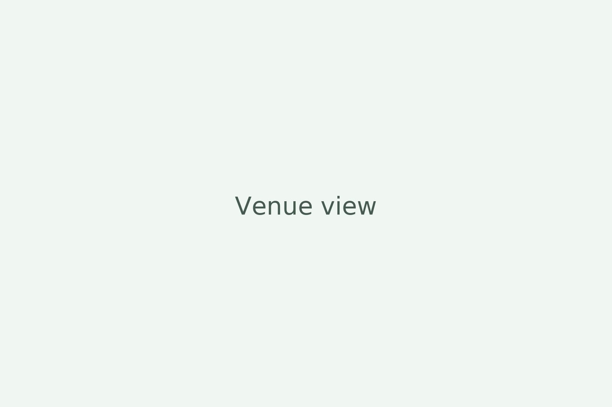
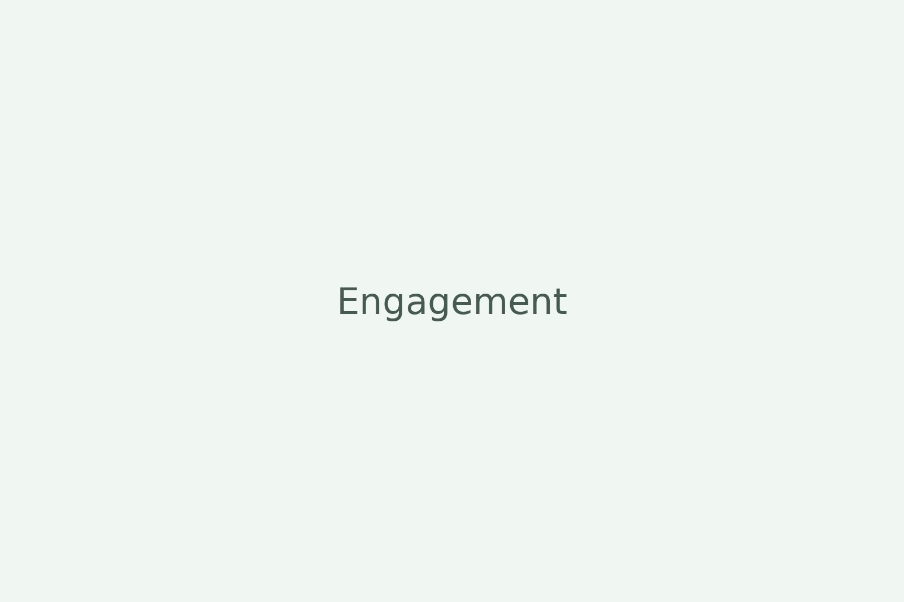

<section class="section">
  

    <h1 class="h1">Gallery</h1>
    
We’ll add engagement and wedding photos here. For now, enjoy a few placeholders.

    

      <figure class="sr"></figure>
      <figure class="sr"></figure>
      <figure class="sr"></figure>
    

  

</section>
